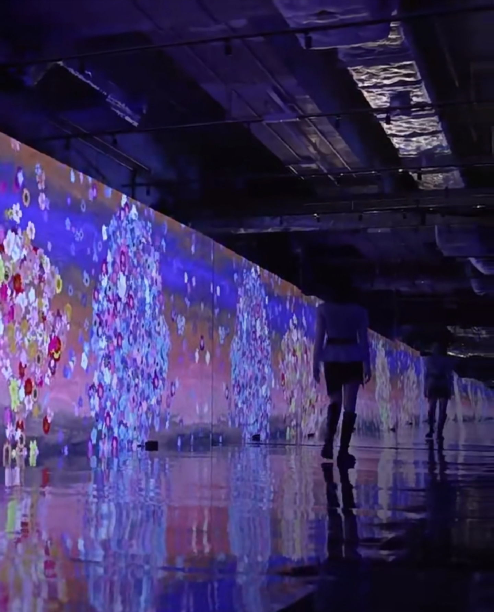

# jzhe0080_9103_tut2
Individual Animation Documentation
1. Project Overview

This project preserves the artistic style and composition of the original work. While incorporating real-time animation, it also enables viewers to explore the piece directly by interacting with it through mouse dragging. The goal is to maintain the visual identity of the group composition while introducing a distinct, interaction-driven motion system.

2. Individual Animation Approach

I chose interaction as the driving principle of my code. Rather than modifying colour or size, my animation focuses on motion along curved trajectories. The movement is expressed through three layers:

A. Orbiting units: Individual circular components or bead elements orbit around their parent wheel.

B. Drifting motion: Wheels drift slightly, following slow sinusoidal or Lissajous-like paths.

C. Asynchrony: Each element moves at a different speed to produce varied, asynchronous motion across the composition.

This ensures that the behaviour of the piece emerges from user input rather than predetermined choreography.

3. Inspiration

The images referenced are from Hana Fubuki (2019). In the installation, flowers on the wall gather and move in response to the direction of a visitor’s hand. Inspired by this interaction, I aimed to create a similar effect: allowing users to reshape or influence the composition through mouse movement and spatial gestures.

4. Technical Implementation

My individual animation approach restructures the original group code into a real-time interactive system driven by user input and continuous geometric recalculation.

Instead of rendering the composition once, the sketch now operates through a per-frame update model. Each wheel continually recalculates its rotation and corresponding bead chain using a pure geometric generator. A layered perturbation system—combining Perlin noise and sinusoidal offsets—produces soft micro-movements along the chain, generating an organic motion that remains consistent with Pacita Abad’s circular motifs.

Interaction is the primary driver of animation. Mouse velocity is measured frame-by-frame, smoothed through interpolation, and then mapped to subtle variations in chain amplitude. Dragging allows wheels to be repositioned, while cursor-anchored zoom and improved panning support spatial exploration without distorting geometry. These interaction signals feed directly into the perturbation model, creating a continuously adaptive animation that reacts to both precise gestures and broader movements.

Several structural refinements support this behaviour:

Converted the chain generator into a pure function to avoid side effects.

Formalised coordinate transforms to maintain accuracy under zooming.

Removed redundant rendering steps.

Added performance caps to ensure smooth operation on lower-end hardware.

Techniques such as Perlin noise (via p5.js) and cursor-anchored zoom (a standard UI technique) were integrated for their stability and expressive potential. Together, these adjustments produce an animation framework that is technically robust, visually coherent, and meaningfully distinct from other group members’ approaches.